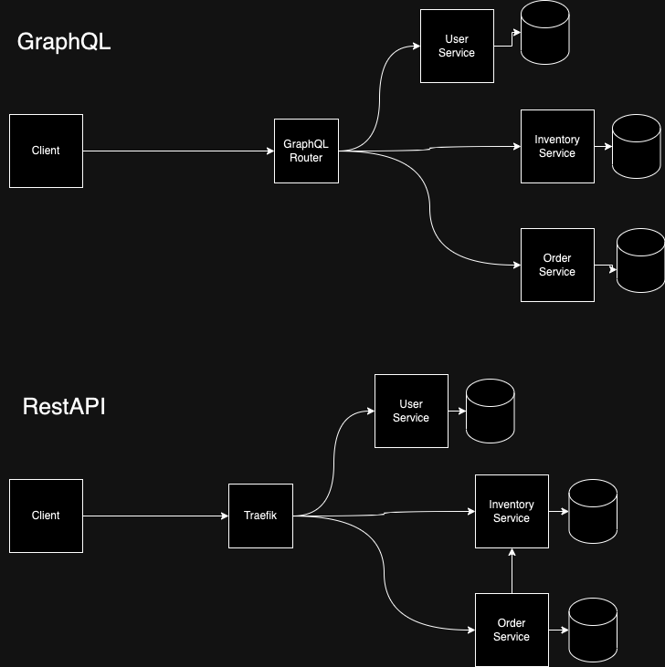
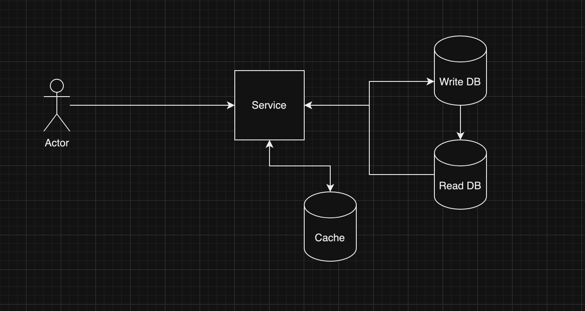
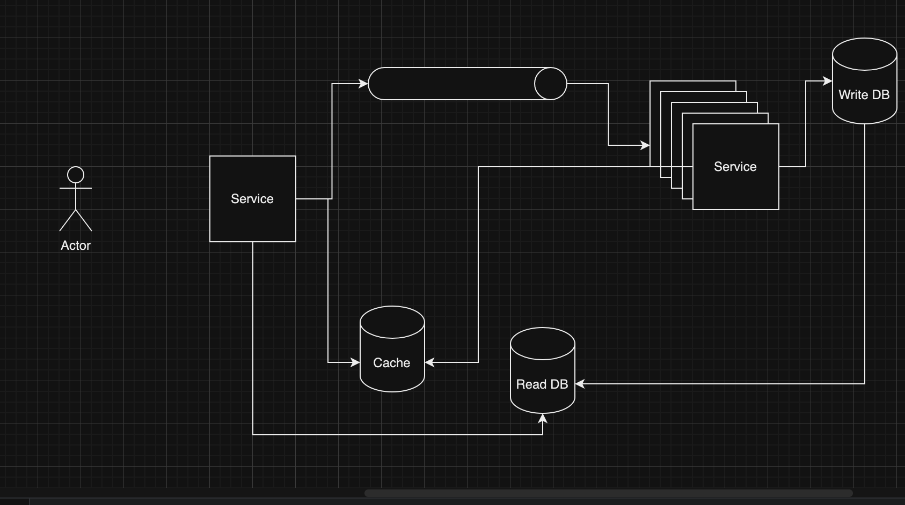

# Ecommerce site example

## Setup
Currently there are two sepoaratly deployed systems: 
* Backend
  * Deployed in kubernetes cluster with ArgoCD and using helm charts. (https://reebelo.floretos.com/graphql)
* Frontend
  * Deployed on vercel (https://reebelo.vercel.app/orders)

## Backend
The backend consists of 3 services (auth, inventory, order). They are all microservices built with NestJS Framework. The
reason for using NestJS is familiarity and I personally like how well structured it is. Additionally, if this was built
as a monolith, it would be very easy to break apart into microservices if you follow their philosophy of using modules. 
As a transport layer, I have used GraphQL. The reason for this is the ease of use for microservices. Just publish the 
schmea to apollo studio and it will redirect queries/mutations to the right service. Essentially a free BFF.
Additionally, it is very easy to completely have separation of concerns between other microservices. Notice that I have 
defined `items` type in inventory which doesnt need to know anything about `Order` except that its a type and will 
provide `itemIds` and `quantity`. Orders service has no idea about the Inventory Service. With RestAPI, you would need 
to call the inventory service when you call the order service to get the items in the order. 

Below you can see the differnce in GraphQL vs RestAPI

### Deployment
The backend is deployed in a kubernetes cluster using helm charts. The ArgoCD repo is in a private repo but you can see
a subset of the files at [./Argocd-example](./Argocd-example). The helm chart is in the reebelo-api folder.

### Auth
This service handles signing up users, refreshing tokens, and signing in users. It uses JWT for authentication and 
randomly generated refresh tokens. Due to time constraint, only this service has tests. 

### Inventory
This service handles the inventory of items. It hold quantity and price of items. Unfortunately due to time contraints
the implementation of reducing, increasing quantity is not implemented. They mutations exist, but they are not used.

### Order
This service handles the orders. It holds the items and quantity of items. Price is calculated locally.

## Frontend
The frontend is built with NextJS using react-query, tailwindcss, headlessUI, and zustand. 

## Tests
There is a lack of tests due to time constraints. You can see an example of tests in the Auth service. Normally there 
a set of tests I would do and they are mostly the same for backend and frontend. 
* Unit tests
  * Test each function in isolation
  * Test each component with react testing library. Component testing should be separate from any api calls.
* Integration tests
  * Mostly for backend, use docker-compose if need, run tests against a real database, ensure migrations work, etc
  * For frontend, mock api calls
* E2E tests
  * Use cypress to test the whole application, can be done in CI/CD or a separate service in the kubernetes cluster,
    the cloud provider it is hosted in or even locally.

## CI/CD
For Backend, I use github actions and build a docker image to push to a self-hosted docker registry. Then I use ArgoCD
and for now manually update the version. Normally I will create a github action to update the version and push to the 
ArgoCD repo. For frontend, I use Vercel and it automatically deploys on push to master.

## Initial improvements that could be done
There was not enough time to implement the most optimal solution and implement all necessary features. Below are some
improvements that could be done to make this more production ready.

### Backend
* Add more tests
* Use streams instead of api calls. We could separate out the requests to actual services processing the requests. 
  Compare the images below:
  Basic:
  
  Stream:
  
  In the stream example, we can scale separately the service getting requests and the service processing them. We can
  then use the cache to temporarily update the quantity and then update the database. This will ensure eventual 
  consistency while providing updated values to the client in a faster way.
* Improvements on structure in terms of naming, return types for data.
* Improvemnets on error handling. Currently, I am just throwing errors. I would like to have a more structured way of
  handling errors such as provide codes for errors along with a message.
* Currently Cart only exists on the client side. It should exist on the backend with a link to the user. This way, if
  the user logs in from another device, they can still see their cart.
* Better management of api calls on the frontend. The components tend to have too much logic. To solve this I would
  need to do some fixing on the backend. Ex: To create an order, you actually send multiple orders to the backend. This 
  should only be one call. 